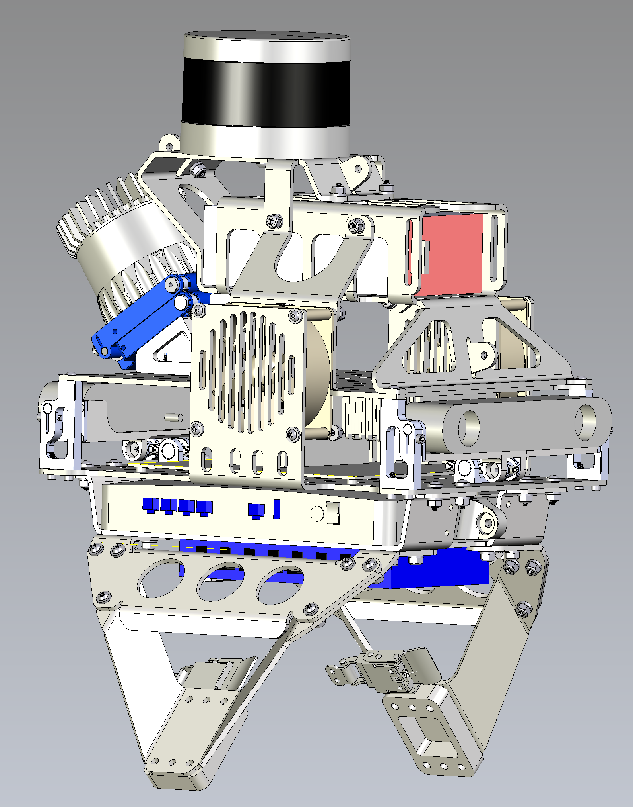

# torso_design_for_cassie

## Overview
This repository provides the CAD model of a perception suite for Cassie-series robots. We use it extensively and regularly for our autonomy experiments. 

This perception suite is able to rigidly hold two RGB-D cameras and two LiDARs. In addition, two fans are used to vacillate two Jetson AGX Xaviers with GPUs. Furthermore, a router, an USB hub, and an internet switch are utilized for communication among users, Cassie, and the perception suite. Finally, a 12-volt LiPo battery powers up all the sensors.

* Author: Jiunn-Kai (Bruce) Huang and Jessy W. Grizzle
* Maintainer: [Bruce JK Huang](https://www.brucerobot.com/), brucejkh[at]gmail.com
* Affiliation: [The Biped Lab](https://www.biped.solutions/), the University of Michigan

## Quick View
Illustration of the front and the back view of the suite.

## Adjustable and fixable mounts
We design adjustable mounts for the cameras and the LiDARs, so that the sensors are able to gather information from various angles around the robot.
The adjustable mounts are also able to screw-lock in place.

## The suite without sensors
The frame of the sensor suite is made of 1/8 5052 sheet metal (black) to firmly support the weights of the sensors and the sensor mounts are made of 2024 aluminium (silver).

## The suite with sensors and Cassie Blue

